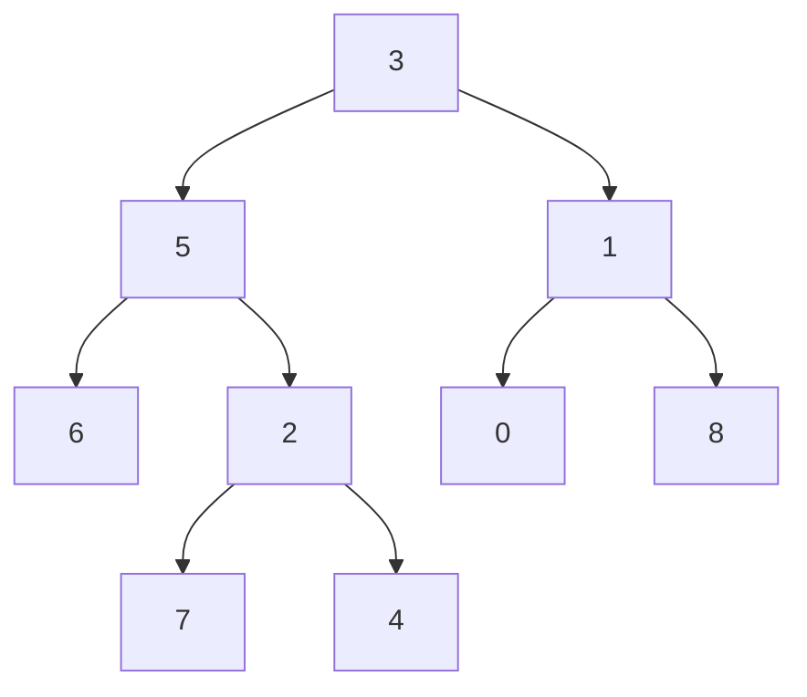

# Leetcode 863: All Nodes Distance K in Binary Tree

---

https://leetcode.com/problems/all-nodes-distance-k-in-binary-tree/description/

---

**Difficulty:** Medium  
**Topics:** Hash Table, Tree, Depth-First Search,
Breadth-First Search, Binary Tree

## Description

Given the `root` of a binary tree, a target node `target`,
and an integer `k`, return an array of the values of all
nodes that are exactly distance `k` from the target node.
You may return the answer in any order.

## Examples

**Example 1**

ASCII diagram (target node = 5):

```
        3
      /   \
     5     1
    / \   / \
   6   2 0   8
      / \
     7   4
```

Mermaid:



Input: `root = [3,5,1,6,2,0,8,null,null,7,4]`, `target = 5`,
`k = 2`  
Output: `[7, 4, 1]`  
Explanation: Nodes distance 2 from the target (value 5) are
7, 4, and 1.

**Example 2**  
Input: `root = [1]`, `target = 1`, `k = 3`  
Output: `[]`

## Constraints

- Number of nodes is in the range `[1, 500]`.
- `0 <= Node.val <= 500`.
- All `Node.val` values are unique.
- `target` is the value of one of the nodes in the tree.
- `0 <= k <= 1000`.

---

```cpp
/**
 * Definition for a binary tree node.
 * struct TreeNode {
 *     int val;
 *     TreeNode *left;
 *     TreeNode *right;
 *     TreeNode(int x) : val(x), left(NULL), right(NULL) {}
 * };
 */
class Solution {
public:
    vector<int> distanceK(TreeNode* root, TreeNode* target, int k) {

    }
};
```

```py
# Definition for a binary tree node.
# class TreeNode:
#     def __init__(self, x):
#         self.val = x
#         self.left = None
#         self.right = None

class Solution:
    def distanceK(self, root: TreeNode, target: TreeNode, k: int) -> List[int]:
        pass
```

---

# Solutions

**@p13i**:

It is trivial to find the nodes that are `k` levels below a
node: e.g., BFS for `k` levels.

To find nodes that are `k` levels above a node, we can use a
space-limited stack-like structure that will keep a record
of the `k` parents of the current node as we search for the
`target` node under the `root`.

After finding the target, we can do a BFS in three
directions:

1. left child
2. right child
3. parent

To faciliate the lookup from a node to its parent, we can
use our lookup stack. The space needed will be:

$$ O( k ) $$

to maintain a parent `lookup` structure and similar order
for performing a BFS(?). The time needed will be dependent
on `k` and how long it will take to find the `target`, as
much as:

$$ O( n ) $$

for `n` nodes in the tree.

The pseudo-code for such an algorithm is:

1. Find the `k`-th parent of `target` and build a
   child-to-parent lookup structure.
2. Perform a three-way breadth-first-search until saving the
   `k`-th row.
3. Return the `k`-th row of this BFS as the resultant list.
